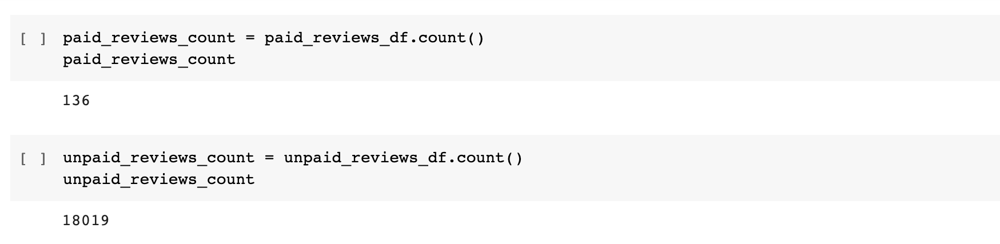

# Amazon_Vine_Analysis
UCB Challenge: Perform an ETL on a given datataset using Pyspark, an AWS RDS instance and pgAdmin.  

# Overview of Analysis
In this module we were given the task to select a dataset from list provided to use PySpark to perform the ETL process to extract the datasets, transform the data, connect to AWS RDS Instance, and load the transformed data into pgAdmin. Afterward, we had to determine if there was any bias toward favorable reviews from Vine members in the dataset selected using either PySpark, Pandas or SQL for analysis. For my analysis, chose the US furniture dataset.

# Results:

## Number of review given by Vine and non-Vine members
* There were 136 Vine member reviews in total.
* There were 18109 non-Vine member review in total.

## Number of Five Star reviews by Vine Members and Non-Vine Members 
How many Vine reviews were five stars? How many non-Vine reviews were five stars?
* There was a total of 74 Vine reviews that were five stars.
* There was a total of 8482 non-Vine review that were five stars.

## Percentage of Five Star reviews by Vine Members and Non-Vine Members 
* 54% of Vine member reviews that were five stars
* 47% of non-Vine member reviews were five stars

# Summary

The percentage of reviews that were 5 stars from both Amazon Vine members and non Amazon Vine members shows bias, specifically those made by Vine members, for the US Furniture datasets. 

        54% of reviews made by Amazon Vine members were 5 stars
        47% of reviews made by Non-Amazon Vine members were 5 stars

I think it would be interesting to do a similar side by side comparison of the Amazon "sponsored" products versus those that are not, that actually have the same specifications and functions, from both Vine and non-Vine members to further support this conclusion.

## DataFrames that were loaded into pgAdmin - Successful Connections

